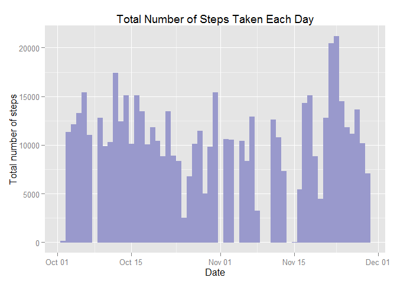
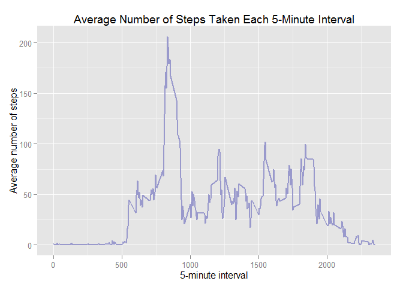

# Reproducible Research: Peer Assessment 1


```r
library(knitr)
opts_chunk$set (echo = TRUE)
```


## Loading and preprocessing the data

```r
data <- read.csv("activity.csv", colClasses = c("integer", "Date", "integer"))
withoutNA <- na.omit (data)
```

## What is mean total number of steps taken per day?

* Make a histogram of the total number of steps taken each day

```r
library(ggplot2)
ggplot(withoutNA, aes(date, steps)) + geom_histogram(stat = "identity") + labs(title = "Total Number of Steps Taken Each Day", x = "Date", y = "Total number of steps")
```

 

* Calculate and report the mean and median of the total number of steps taken per day
      * mean of the total number of steps taken per day:

```r
total_steps <- tapply (withoutNA$steps, withoutNA$date, sum)
mean(total_steps)
```

```
## [1] 10766.19
```
      
      * median of the total number of steps taken per day:      

```r
median(total_steps)
```

```
## [1] 10765
```


## What is the average daily activity pattern?

* Make a time series plot (i.e. type = "l") of the 5-minute interval (x-axis) and the average number of steps taken, averaged across all days (y-axis)


```r
library(plyr)
mean_steps <- ddply (withoutNA, .(interval), summarize, avg_steps = mean (steps))
ggplot(mean_steps, aes(interval, avg_steps)) + geom_line() + labs(title = "Average Number of Steps Taken Each 5-Minute Interval", x = "5-minute interval", y = "Average number of steps")
```

 

* Which 5-minute interval, on average across all the days in the dataset, contains the maximum number of steps?


```r
mean_steps [mean_steps$avg_steps == max(mean_steps$avg_steps),] [1]
```

```
##     interval
## 104      835
```


## Imputing missing values

* Calculate and report the total number of missing values in the dataset (i.e. the total number of rows with NAs)


```r
sum(is.na(data))
```

```
## [1] 2304
```


## Are there differences in activity patterns between weekdays and weekends?
